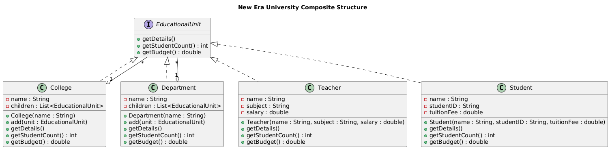

# 🎓 New Era University Composite System

This project models the organizational structure of **New Era University** using the **Composite Design Pattern** in Java.  
It represents Colleges, Departments, Teachers, and Students in a hierarchical structure, allowing recursive composition and unified operations.

---

## 📌 Features
- **Hierarchical Modeling**: Colleges can contain Departments, Teachers, Students, and even other Colleges.
- **Composite Design Pattern**: Provides a uniform interface (`EducationalUnit`) for all entities.
- **Student Count Calculation**: Computes the total number of students in any College or Department.
- **Budget Calculation**:
  - College budget = sum of all contained units (departments, teachers, students).
  - Department budget = sum of teachers’ salaries − students’ tuition fees.
  - Teacher budget = salary.
  - Student budget = negative tuition fee.
- **Details Display**: Prints organized details of Colleges, Departments, Teachers, and Students.

---
